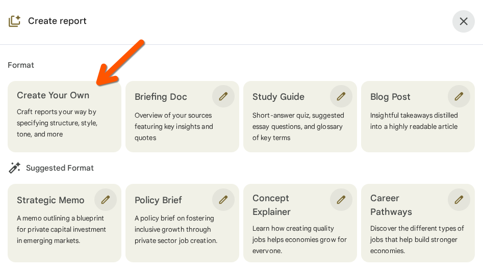
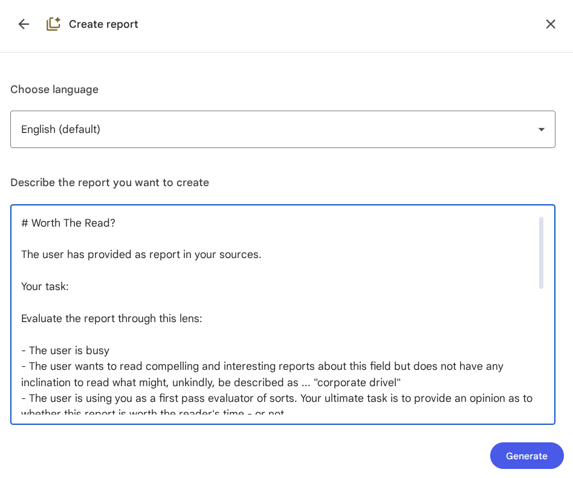

# NotebookLM Custom Prompts 📚

> **Quick Start**: 🚀 [**All-in-One File**](one-in-all/all-prompts.md) | 🇪🇺 [**EU-DRULE System**](EU-DRULE/README.md)

## Motivation

I've spent a decent chunk of my career working in fields where "thought leadership" and report-writing are rife.

Thought leadership, done well, is an important endeavor. So is staying up to date on what's happening in an industry.

However, there is also an undeniable trend, in certain industries, to produce long documents just because it feels or looks productive to be doing so.

Reports are often mixed bags: a few original ideas buried amidst chapters of dreary regurgitated statistics. How can one—sorry to be trite—separate wheat from chaff?

Large language models (LLMs) are fantastic companions in this regard. I love NotebookLM, but it is inherently polite and deferential. Which is why I've found value in maintaining a few slightly more blunt prompts that can be pasted into the custom generation section (or used any other way you wish!)

---

## 🚀 Specialized Systems

### 🇪🇺 EU-DRULE - EU Digital Regulation Analysis System
*A comprehensive multi-role AI system specialized for EU digital regulations analysis*

**[📖 View EU-DRULE Documentation](EU-DRULE/README.md)**

**Core Components:**
- **[🎯 Core System Prompts](EU-DRULE/core-prompts/)** - Multi-role AI analyst engine (Legal, Policy, Impact, Action, Consultation, Intel)
- **[🔧 Extension Packages](EU-DRULE/addons/)** - Modular enhancements for critical analysis, custom reporting, and format templates
- **[📚 Design Documentation](EU-DRULE/docs/)** - System architecture and development insights

**Quick Links:**
- **[CN Version v1.4](EU-DRULE/core-prompts/EU-DRULE-SystemPrompt-Core-v1.4.md)** - Latest Chinese core system
- **[EN Version v1.4](EU-DRULE/core-prompts/notebooklm_eu_reg_system_prompt_v1_4.md)** - Latest English core system
- **[📊 Report Format Toolkit](EU-DRULE/addons/[EU-DRULE-ADDON-03]%20Report-Format-Toolkit%20(v1.0).md)** - 10 professional report templates

---

## 📋 All Available Prompts

### 🎯 Quick Access Matrix

| **Purpose** | **Prompts** | **Quick Link** |
|------------|-------------|----------------|
| **🔍 Quick Evaluation** | 3 prompts for rapid report assessment | [View Analysis →](#quick-evaluation-prompts-analysis) |
| **📊 Data Extraction** | 5 prompts for specific information extraction | [View Extraction →](#data-extraction-prompts) |
| **📝 Report Generation** | 2 prompts for comprehensive outputs | [View Generation →](#report-generation-prompts) |
| **🤖 System Configuration** | 1 prompt for AI personality setup | [View System →](#system-prompts) |

### 📖 Comprehensive Compilation
- **[📄 All Prompts (Single File)](one-in-all/all-prompts.md)** - Complete collection with descriptions and usage guidance in both English and Chinese

---

## 🤖 System Prompts

- **[The Jaded Report Reader](system-prompts/report-skeptic.md)** - A personality-defining system prompt for creating a skeptical assistant that evaluates reports with healthy skepticism

---

## 🔍 Quick Evaluation Prompts (Analysis)

*For rapid assessment of report value and originality*

- **[Anything Interesting?](analysis/anything-interesting.md)** - Evaluates whether a report contains original ideas, noteworthy statistics, or strong opinions
- **[Original Thinking?](analysis/original-thinking.md)** - Assesses whether a report contains genuinely new ideas or just regurgitated content
- **[Worth The Read?](analysis/worth-the-read.md)** - Provides a verdict on whether a report justifies the reader's time investment

---

## 📊 Data Extraction Prompts

*For extracting specific types of information from reports*

- **[Main Arguments Roundup](extraction/main-arguments.md)** - Identifies and summarizes the report's core thesis, supporting arguments, evidence strength, and counterarguments
- **[Noteworthy Findings](extraction/noteworthy-findings.md)** - Identifies unexpected or novel findings that contradict or extend previous research
- **[Interesting Statistics](extraction/interesting-stats.md)** - Extracts and organizes key statistics thematically with page references
- **[Case Studies Analysis](extraction/case-studies.md)** - Extracts and organizes case studies thematically, identifying what they demonstrate and providing page references
- **[Key Snippets](extraction/key-snippets.md)** - Extracts memorable quotes and key passages from the report

---

## 📝 Report Generation Prompts

*For creating comprehensive analysis outputs*

### Executive Summary
- **[Executive Summary](generation-prompts/exec-summary/exec-summary.md)** - Generates a critical executive summary evaluating both content and credibility

### Comprehensive Analysis
- **[Comprehensive Report Analysis](generation-prompts/combined/comprehensive-report-analysis.md)** - An all-in-one prompt combining read/skip assessment, opinionated executive summary, statistical overview, case studies analysis, and key quotes extraction

## 💡 How to Use These Prompts

### 🚀 Quick Start Options

1. **📄 All-in-One**: Use the [comprehensive file](one-in-all/all-prompts.md) for all prompts in one place
2. **🇪🇺 EU-DRULE**: For EU regulations, use the [specialized system](EU-DRULE/README.md)
3. **🎯 Individual**: Pick specific prompts from the categories below

### 📱 NotebookLM Workflow





**Current UI Flow (as of November 2025):**

1. Add report as source
2. Go to Studio
3. Create report
4. Create your own
5. Copy and paste a prompt from this repository

### 🎯 Prompt Selection Guide

| **Your Goal** | **Recommended Prompt** | **Category** |
|---------------|----------------------|--------------|
| "Should I even read this?" | [Worth The Read?](analysis/worth-the-read.md) | Quick Evaluation |
| "Anything actually new here?" | [Original Thinking?](analysis/original-thinking.md) | Quick Evaluation |
| "Just give me the key points" | [Executive Summary](generation-prompts/exec-summary/exec-summary.md) | Report Generation |
| "I need specific data" | [Interesting Statistics](extraction/interesting-stats.md) | Data Extraction |
| "Analyze EU regulations" | [EU-DRULE System](EU-DRULE/README.md) | Specialized System |
| "Everything in one go" | [Comprehensive Analysis](generation-prompts/combined/comprehensive-report-analysis.md) | Report Generation |

---

## 🏗️ Repository Structure

```
NotebookLM-Custom-Prompts/
├── 📋 README.md                    # This file
├── 🚀 one-in-all/                  # All prompts in single file
├── 🇪🇺 EU-DRULE/                   # Specialized EU regulation system
├── 🔍 analysis/                    # Quick evaluation prompts
├── 📊 extraction/                  # Data extraction prompts
├── 📝 generation-prompts/          # Report generation prompts
├── 🤖 system-prompts/              # System configuration prompts
└── 📸 screenshots/                 # Usage examples
```

---

## 🤝 Contributing

Feel free to submit issues or enhancement requests. When adding new prompts:

1. Follow the existing naming conventions
2. Include clear descriptions and use cases
3. Test with NotebookLM's 300-word limit
4. Consider adding to the [all-in-one file](one-in-all/all-prompts.md)

---

*Last updated: November 2025 | Prompts optimized for NotebookLM's 300-word limit* 